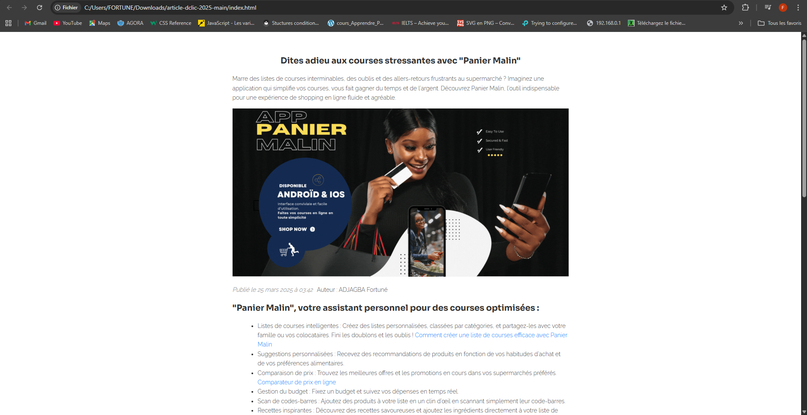
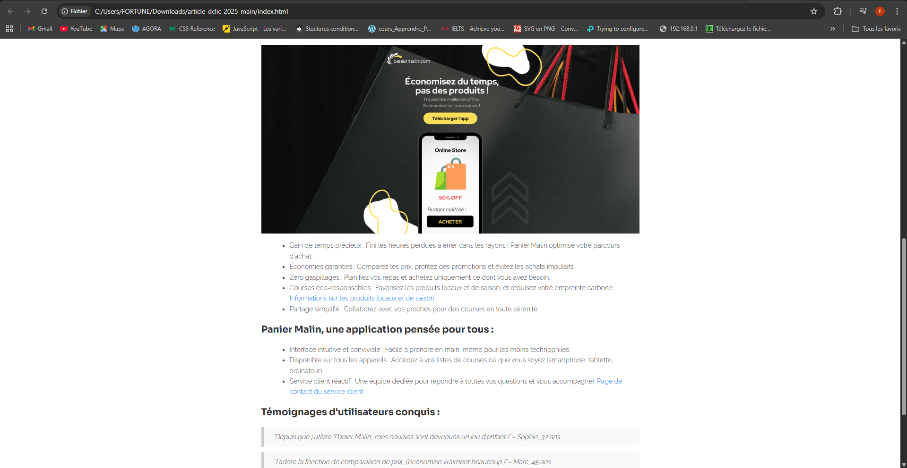

  
  

Lancement d'une application de gestion de courses en ligne :
- Structure du Contenu (Marketing) : L'article est structuré pour maximiser l'engagement, utilisant des titres clairs (<h2> et <h1>) et des listes d'avantages (<ul>) pour faciliter la lecture rapide (scannabilité) et le référencement naturel.
- Optimisation SEO : Utilisation de la méta-description et des mots-clés pertinents ("application courses en ligne," "comparateur prix courses," etc.) ainsi qu'une structure H1/H2 pour un meilleur positionnement.
- Expertises : marketing numérique, Rédaction web et développement front-end.

